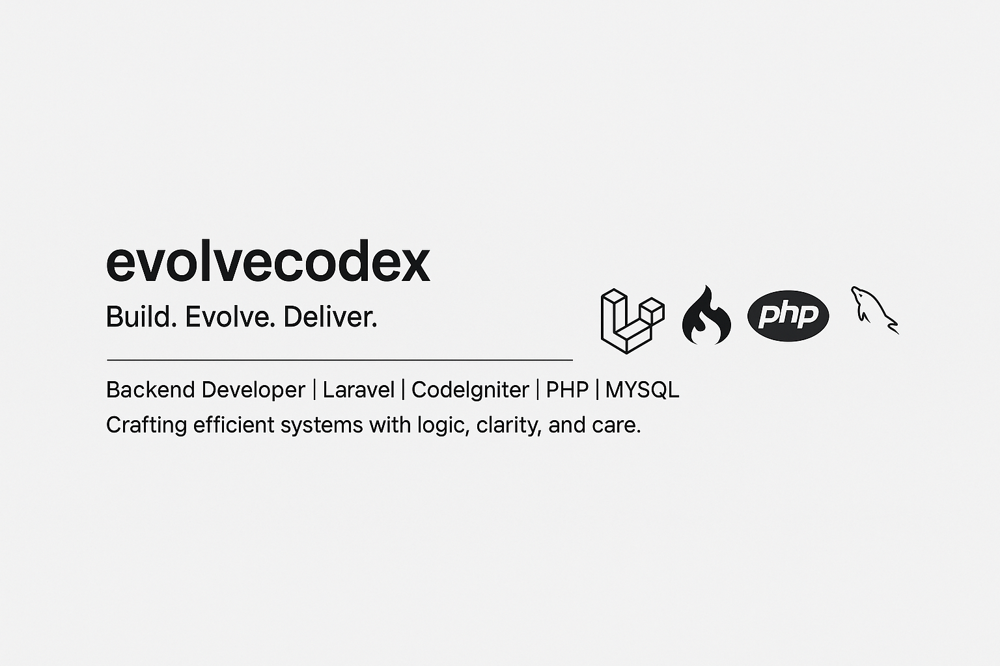

# Hi there, I'm evolvecodex!

**Backend Developer** with strong experience in **Laravel**, **CodeIgniter**, **PHP**, and **MySQL**.  
Currently learning **Golang** and **React**, and actively exploring system design patterns that scale well.

I focus on crafting clean, maintainable systems with logic, clarity, and care.  
Also experienced in building apps using **Flutter** and **Kotlin** on a functional level.

---

### 🚀 Tech Stack

- **Languages**: PHP, SQL, JavaScript, Golang (learning)
- **Frameworks & Tools**: Laravel, CodeIgniter, React (learning), Flutter, Kotlin, WordPress
- **Database**: MySQL
- **Others**: REST API, Telegram Bot, Git, Linux/Nginx, OCR, WebSocket

---

### 🧠 Project Highlights

> Most of my projects are **private repos** due to NDA and client agreements.  
> But here are some highlights of what I’ve worked on:

- **Digital Truck Weighing System** – Laravel + OCR + Python with photo evidence & manual override
- **Booking-Based Loyalty System** – Dynamic credit & coupon logic built into WordPress
- **Custom ERP Modules** – Inventory, HR, and multi-role sales systems with clean backend structure
- **Telegram Bot Integration** – Automations for notifications, tasks, and simple data triggers
- **Web E-Commerce** – Built on both WordPress and CodeIgniter
- **Mobile Apps** – Lightweight internal apps using Flutter & Kotlin
- **Landing Pages** – Clean & responsive designs for marketing & campaigns

> Want to see code samples? I can provide walkthroughs or snippets upon request.

---

### 📫 Contact Me
 
- **LinkedIn**: [linkedin.com/in/evolvecodex](https://bit.ly/yandri-nurdiana)  
- **Email**: yandrinurdiana@gmail.com

---

> *“Build. Evolve. Deliver.”*  
> Always evolving. Always coding.
